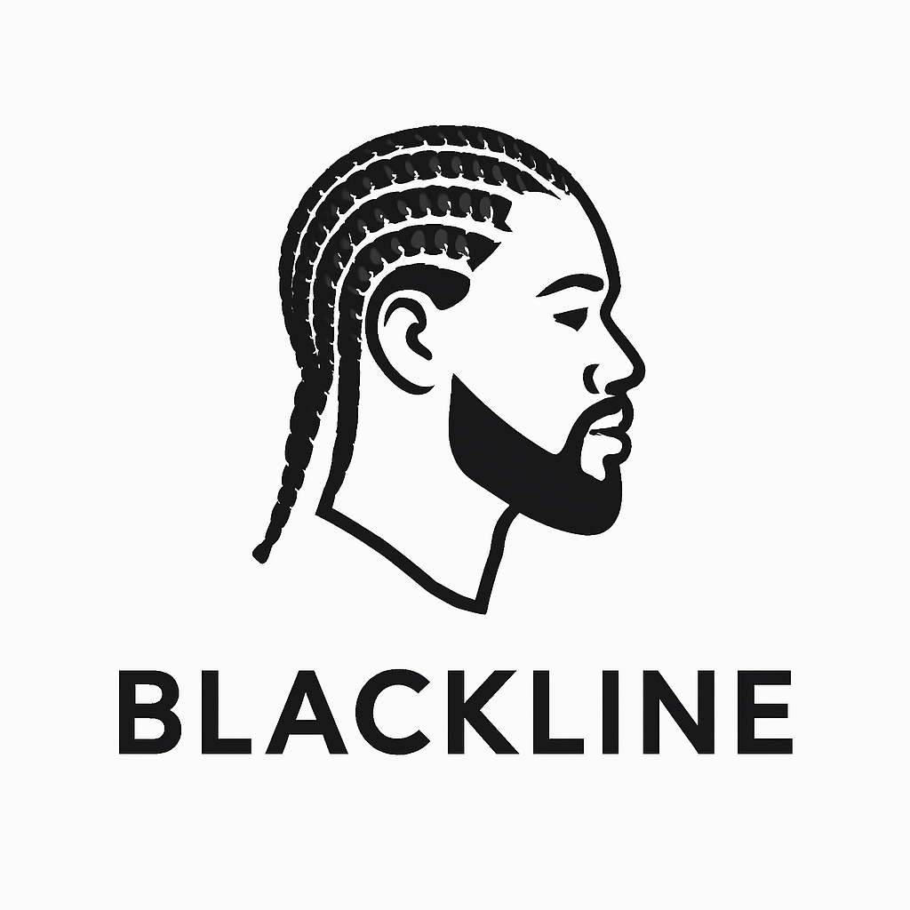

<!--START_SECTION:header-->

  

    
    <h1>blackline-barber-ui</h1>
  

## 💈 Sobre o Projeto

**BlackLine Barber** é uma aplicação **SPA (Single Page Application)** desenvolvida com **Angular**, voltada para a gestão de barbearias com foco em representatividade, eficiência e experiência do usuário. A solução foi pensada para valorizar o público preto e oferecer uma ferramenta moderna e intuitiva para **cadastro de clientes, controle de agendamentos** e **navegação entre funcionalidades essenciais**.

O projeto se destaca por uma **interface responsiva e acessível**, construída com **Angular Material**, que oferece uma experiência visual limpa e profissional, aliada à facilidade de uso tanto em desktop quanto mobile.

Este projeto foi desenvolvido como parte do **Bootcamp DecolaTech - DIO (Digital Innovation One)**, com o objetivo de aplicar conceitos avançados de front-end e boas práticas no uso do framework Angular, incluindo a utilização do Angular Material via Angular CLI.

A aplicação consome uma **API REST** desenvolvida em **Java com Spring Boot**, responsável por todo o backend do sistema. Essa API permite realizar operações **CRUD (Create, Read, Update, Delete)** para os dados de clientes e agendamentos, com integração ao banco de dados PostgreSQL e possibilidade de deploy utilizando Railway e Docker.

---

### ⚙️ Funcionalidades Implementadas

- ✅ **Home page personalizada** com logo, mensagem de boas-vindas e navegação intuitiva  
- ✅ **Menu de navegação fixo**, com seções bem definidas: Início, Clientes e Agendamentos  
- ✅ **Cadastro de clientes**, com formulário validado e conexão direta com a API  
- ✅ **Listagem de clientes cadastrados**, com exibição de dados essenciais  
- ✅ **Edição de clientes**, com redirecionamento dinâmico via rota parametrizada  
- ✅ **Calendário de agendamentos**, com visualização por mês e organização por cliente  
- ✅ Integração total com **API REST** desenvolvida em Spring Boot  
- ✅ Utilização de **componentes reutilizáveis** e abordagem **modularizada**  
- ✅ Estilização com **SCSS**, seguindo boas práticas de organização visual e estrutura moderna

---

## 📚 Pré-requisitos

Antes de iniciar, é interessante ter noções básicas/intermediárias de:

- JavaScript / TypeScript  
- HTML e CSS  
- Angular CLI  
- Angular Material  
- Comunicação com APIs REST  
- (Opcional) Docker e Docker Compose  

---

## 🛠️ O que você vai praticar

- Criar e configurar um projeto Angular via CLI  
- Instalar e aplicar **Angular Material** para uma interface profissional  
- Estruturar rotas e componentes reutilizáveis  
- Integrar com uma API backend para operações CRUD  
- Criar uma home page, menu de navegação e telas de agendamento e cadastro  

---
## 🔗 Link API: 
https://github.com/CaroliisRibeiro/barber-shop-api
---

## 🚀 Objetivos

Ao final do projeto, você será capaz de:

- Montar uma aplicação SPA com Angular  
- Criar componentes reutilizáveis e organizados  
- Fazer chamadas a uma API para listar, criar e editar clientes e agendamentos  
- Personalizar a interface com foco em acessibilidade e representatividade  

---

## 📆 Bootcamp

Este projeto foi construído no contexto do **Bootcamp DecolaTech (DIO)**, uma iniciativa educacional qu
